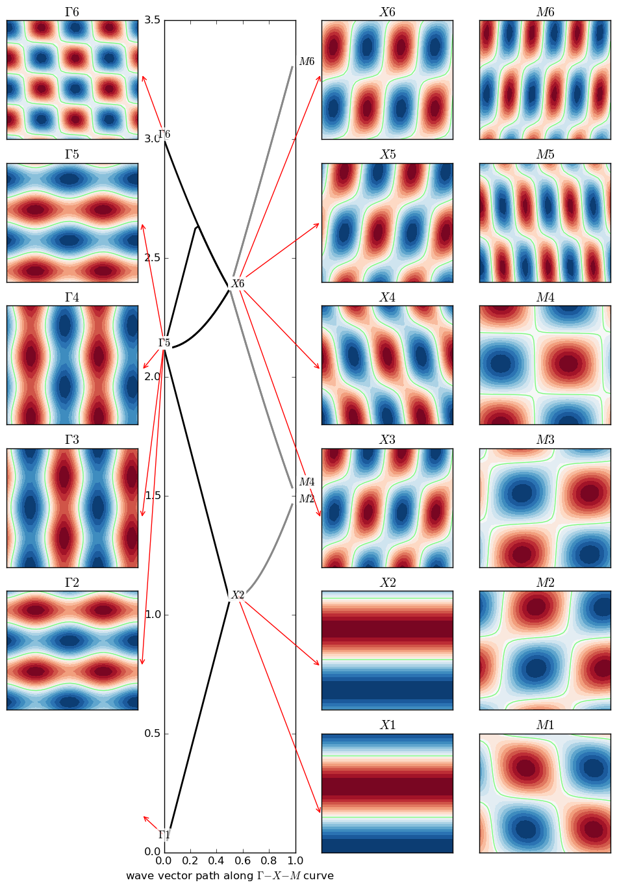

## Overview of mpb-plotting 

Plot photonic dispersion curves with mode shapes (a frontend to MIT Photonic bands)

A set of Scheme/Python scripts that computes and plots the band structure of a 2-D photonic crystal and,
most importantly, draws also the modes corresponding to the band edges.

The `batch.sh' script feeds `compute_dispersion_and_modes.ctl' to the MPB program to get the numerical data. 
Then it runs `plot_dispersion_and_modes.py' to plot all results (see this file for explanation). This procedure 
can be repeated in a cycle in batch.sh, mapping how the electromagnetic behaviour of the structure changes with 
some of its parameters.

Written in 2013-15 by Filip Dominec, filip.dominec@gmail.com

## Example 
A typical output of the script follows. This one shows six dispersion curves, and all corresponding modes, for a periodic dielectric slab with a permittivity of 2 and 30% filling fraction.

For some physical background, see the and excellent book '''Photonic Crystals: Molding the Flow of Light'''  (freely available from http://ab-initio.mit.edu/book/)

## Requirements
* unix-like environment with a bash-like shell
* mpb
* python-numpy
* python-matplotlib
* (imagemagick)

## TODOs
[ ] sync with the project from 2014-01 and cleanup of old code
[ ] add all relevant structures (rods, holes, etc.)
[ ] enable electric/magnetic field switching
[ ] write some better documentation, add more example plots
[ ] (test anisotropy of materials?)
